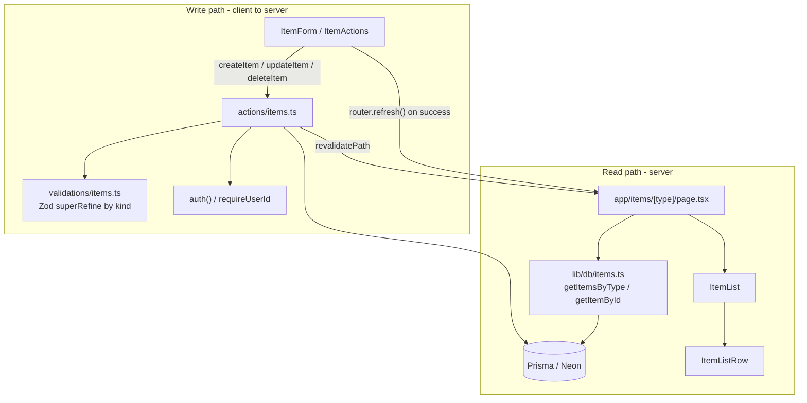

# Item CRUD Architecture

A design for a **single, unified CRUD system** covering all 7 item types
(snippet, prompt, command, note, file, image, link). One mutation file, one
query module, one dynamic route, and a set of shared components that adapt their
fields and rendering by type.

> Design date: 2026-09-05. Grounded in the existing codebase conventions:
> `context/coding-standards.md`, `context/ai-interaction.md`,
> `docs/item-types.md`, `prisma/schema.prisma`, and the patterns already in
> `src/actions/auth.ts`, `src/lib/db/*`, `src/lib/validations/auth.ts`,
> `src/app/items/[type]/page.tsx`, `src/components/dashboard/*`.
>
> The research prompt references `src/lib/constants.tsx` and
> `docs/content-types.md`; the actual files are
> **`src/lib/type-presentation.ts`** (icon/color presentation) and
> **`docs/item-types.md`** (the type reference). This doc uses the real names.

---

## 1. Guiding principles

1. **One `Item` model, no per-type tables.** All 7 types are rows in `Item`
   discriminated by `typeId` → `ItemType`. CRUD never branches on type at the
   database layer.
2. **Mutations = Server Actions.** Per coding standards, "Server Actions for
   form submissions and simple mutations". All item writes live in one file:
   `src/actions/items.ts`.
3. **Queries = `src/lib/db/*`, called directly from server components.** No API
   routes for reads. Extend the existing `src/lib/db/items.ts`.
4. **API routes only where standards demand them** — none are needed for item
   CRUD (no webhooks, no upload progress, no external clients yet). File
   uploads to R2 are the one likely future exception (see §8).
5. **Type-specific logic lives in components, not actions.** The action accepts
   the full field surface and validates it; the *form* chooses which inputs to
   show and the *detail view* chooses how to render. Adding a type is a
   presentation change plus a validation branch, never a new code path.
6. **Actions return `{ success, data?, error?, fieldErrors? }`** and use
   try/catch, matching `src/app/api/auth/register/route.ts`.
7. **Everything is scoped by `userId`.** Today that's `getDemoUserId()`
   (`src/lib/db/user.ts`); it becomes `auth()` session user when the dashboard
   is de-demoed. Design for the session now (see §7).

---

## 2. File structure

```
src/
  actions/
    items.ts              # NEW — all item mutations ("use server")
  lib/
    db/
      items.ts            # EXTEND — add list/detail read queries
    validations/
      items.ts            # NEW — Zod schemas, type-aware
    type-presentation.ts  # EXISTING — icon + color classes, single source
  app/
    items/
      [type]/
        page.tsx          # EXTEND — the placeholder becomes the list view
        [id]/
          page.tsx        # OPTIONAL — deep-linkable detail/edit (see §4)
  components/
    items/                # NEW — the shared, type-adaptive component set
      ItemList.tsx            # server: renders rows for a type
      ItemListRow.tsx         # server: one row (generalises dashboard/ItemRow)
      ItemDrawer.tsx          # client: slide-over hosting detail + form
      ItemForm.tsx            # client: the adaptive create/edit form
      ItemDetail.tsx          # client/server: adaptive read view
      ItemActions.tsx         # client: favorite / pin / delete buttons
      NewItemButton.tsx       # client: opens the drawer in "create" mode
      fields/                 # per-concern field components used by ItemForm
        CodeField.tsx         #   snippet, command  (textarea + language select)
        MarkdownField.tsx     #   note, prompt      (textarea, MD preview later)
        UrlField.tsx          #   link
        FileField.tsx         #   file, image       (upload → fileUrl/Name/Size)
        TagsField.tsx         #   all types
        CollectionField.tsx   #   all types
```

Naming follows `context/coding-standards.md`: components
`src/components/[feature]/PascalCase.tsx`, action file `src/actions/[feature].ts`,
validations `src/lib/validations/[feature].ts`.

---

## 3. Layers in detail

### 3a. Mutations — `src/actions/items.ts`

One `"use server"` module. Every export:

1. resolves the current user id (`requireUserId()` helper — `auth()` today's
   `getDemoUserId()` bridge), returns `{ success: false, error: "Unauthorized" }`
   if absent;
2. `safeParse`s the input with a schema from `src/lib/validations/items.ts`;
   returns `{ success: false, error, fieldErrors }` on failure;
3. does an **ownership check** for updates/deletes
   (`prisma.item.findFirst({ where: { id, userId } })`);
4. performs the Prisma write;
5. `revalidatePath()`s the affected routes (§6);
6. returns `{ success: true, data }`.

| Export | Signature | Notes |
|--------|-----------|-------|
| `createItem` | `(input: CreateItemInput) => ActionResult<Item>` | `typeId` in the input; `contentType` is **derived server-side** from the type (`file`/`image` → `"file"`, else `"text"`), never trusted from the client. Enforces Free-tier item cap and Pro gating (§8). |
| `updateItem` | `(id: string, input: UpdateItemInput) => ActionResult<Item>` | Partial field set. Cannot change `typeId` (keep it simple; delete + recreate if needed). |
| `deleteItem` | `(id: string) => ActionResult<{ id: string }>` | Hard delete. `ItemTag` rows cascade (`onDelete: Cascade`). |
| `toggleFavorite` | `(id: string) => ActionResult<{ isFavorite: boolean }>` | Thin convenience wrapper over `updateItem`; read-modify-write on the owned row. |
| `togglePinned` | `(id: string) => ActionResult<{ isPinned: boolean }>` | Same shape as `toggleFavorite`. |
| `moveItemToCollection` | `(id: string, collectionId: string \| null) => ActionResult<Item>` | Validates the target collection is owned by the same user; `null` clears it. |

Shared type: `type ActionResult<T> = { success: true; data: T } | { success: false; error: string; fieldErrors?: Record<string, string[]> }`.

The actions are **type-agnostic**. There is no `createSnippet` / `createLink`.

### 3b. Queries — extend `src/lib/db/items.ts`

Already present: `getPinnedItems`, `getRecentItems`, `getItemTypesWithCounts`,
`getItemTypeByName`, `getItemStats`, `TYPE_ORDER`, `compareTypeOrder`,
`ITEM_INCLUDE`, `toItemWithType`.

Add:

| Function | Purpose |
|----------|---------|
| `getItemsByType(typeId: string, opts?: { collectionId?; favorite?; search? })` | The `/items/[type]` list. Filtered by `userId` + `typeId`, `orderBy: { updatedAt: "desc" }`, `include: ITEM_INCLUDE`. |
| `getItemById(id: string)` | Detail/edit view. `findFirst({ where: { id, userId }, include: { ...ITEM_INCLUDE, collection: true } })`. Returns `null` if not owned → page calls `notFound()`. |
| `getItemFormOptions()` | The lists a form needs: the user's collections (`id`, `name`) and existing tag names for autocomplete. |

Extend `ItemWithType` (or add a richer `ItemDetail` type) so the detail view
gets `content`, `url`, `fileUrl`, `fileName`, `fileSize`, `language`,
`contentType`, `collection` — the dashboard's `ItemWithType` deliberately omits
these and should stay lean for the row lists.

### 3c. Validation — `src/lib/validations/items.ts`

Zod, mirroring `src/lib/validations/auth.ts` (v4 API, `.safeParse`,
`.flatten().fieldErrors`). Strategy: a **base schema + `superRefine` keyed on
the type kind**, rather than 7 separate schemas.

```
kind(typeName): "text" | "url" | "file"
  snippet | prompt | command | note  -> "text"
  link                                -> "url"
  file  | image                       -> "file"
```

- `itemBaseSchema`: `title` (1–200, trimmed), `description` (optional, ≤2000),
  `typeId` (cuid), `collectionId` (cuid | null), `tags` (string[], each 1–50,
  deduped, ≤20), `isFavorite`/`isPinned` (optional booleans).
- `superRefine`:
  - **text** → `content` required non-empty; `language` optional (only
    surfaced for snippet/command); `url`/`fileUrl` must be absent.
  - **url** → `url` required, `z.url()`; `content`/`fileUrl` absent.
  - **file** → `fileUrl` (url), `fileName` (1–255), `fileSize`
    (int > 0, ≤ max) all required; `content`/`url` absent.
- `createItemSchema` = base + refine. `updateItemSchema` =
  `createItemSchema.partial()` re-refined (or `.omit({ typeId: true })` since
  type is immutable on edit).
- The caller passes `typeName`/kind into the refinement context — the schema
  factory takes the resolved `ItemType` so it knows which branch to enforce.

`contentType` is **not** in the schema — the action derives it.

---

## 4. How `/items/[type]` routing works

**One dynamic segment: `src/app/items/[type]/page.tsx`.** It already exists as a
placeholder; this design fills it in.

```tsx
export const dynamic = "force-dynamic";           // live Neon data

export default async function ItemsByTypePage({
  params,
}: { params: Promise<{ type: string }> }) {       // Next 16 async params
  const { type } = await params;
  const itemType = await getItemTypeByName(type);  // case-insensitive; system OR user's custom
  if (!itemType) notFound();

  const items = await getItemsByType(itemType.id);
  return <ItemList type={itemType} items={items} />;
}
```

Mechanics:

- **`type` param = the lowercased `ItemType.name`** (`snippet`, `prompt`,
  `command`, `note`, `file`, `image`, `link`). The sidebar builds these links as
  `/items/${type.name.toLowerCase()}` (`src/components/dashboard/Sidebar.tsx`).
- **Resolution** goes through the existing `getItemTypeByName(name)` in
  `src/lib/db/items.ts` — `findFirst` with
  `name equals … mode: "insensitive"` and
  `OR: [{ isSystem: true }, { userId }]`, so a Pro user's custom type name
  resolves on the same route. Unknown / not-owned → `notFound()` → the 404 page.
- **No `generateStaticParams`.** Custom types are per-user and created at
  runtime, and the list needs live data — this matches the current decision in
  the placeholder page (it dropped `generateStaticParams` and set
  `force-dynamic`).
- **Filters** (favorites, by collection, search) are `?searchParams` on the same
  route, read in the page and passed to `getItemsByType`.

**Create / edit / detail — the "one route" way (recommended).** Per the design
references (`context/screenshots/dashboard-ui-drawer.png` — "Item View / Drawer
UI"), detail and editing happen in a **slide-over drawer** on top of the list,
not a separate page:

- `NewItemButton` (carrying `itemType`) opens `ItemDrawer` in create mode.
- Clicking a row opens `ItemDrawer` in detail mode; an Edit toggle swaps in
  `ItemForm`.
- The drawer reflects state into the URL as `?item=<id>` (or `?item=new`) so it
  is shareable and back-button friendly, without a route change.

**Optional deep-link route: `src/app/items/[type]/[id]/page.tsx`.** A thin server
page that calls `getItemById(id)` → `notFound()` or renders `ItemDetail`
full-page. Useful for share links and no-JS fallback. It reuses the exact same
`ItemDetail` / `ItemForm` components — no logic duplication. Add it only if
share-links are wanted; the drawer covers the core flow.

---

## 5. Where type-specific logic lives (components, not actions)

| Concern | Lives in | Why |
|---------|----------|-----|
| Which **fields** a type shows (code editor vs markdown vs URL vs file upload) | `ItemForm` + `fields/*` | Pure UI. The action accepts every field regardless. |
| How a type **renders** in read mode (syntax highlight, ``, link card, MD render) | `ItemDetail` | Presentation only. |
| **Icon + accent color** per type | `src/lib/type-presentation.ts` (`TYPE_ICON`, `palette()`) | Already the single source; used by sidebar, rows, profile. Extend `PALETTE` when adding a type/color. |
| **Row** layout (identical for all types today) | `ItemListRow` (generalises `dashboard/ItemRow`) | One row component; no per-type variants. |
| `contentType` value (`"text"`/`"file"`) | derived in `createItem` from the type kind | Server-authoritative; never a form input. |
| **Which fields are valid** for a type | `src/lib/validations/items.ts` `superRefine` | The one place type rules are enforced, shared by action and (client-side pre-check) form. |
| **Pro gating** (`file`, `image`, custom types) & **Free item cap** | `createItem` action | Security boundary — must be server-side. |

The mutation layer sees only: `title`, `description`, `typeId`, `collectionId`,
`tags[]`, `content?`, `language?`, `url?`, `fileUrl?`, `fileName?`, `fileSize?`,
`isFavorite?`, `isPinned?`. It validates the combination and writes it. It does
not know a "link" from a "snippet" beyond what the schema branch checks.

---

## 6. Component responsibilities

| Component | Client? | Responsibility |
|-----------|---------|----------------|
| `app/items/[type]/page.tsx` | server | Resolve type from param, `notFound()` on miss, fetch list via `lib/db`, render `ItemList`. `force-dynamic`. |
| `ItemList` | server | Header (type name, count, `NewItemButton`, filter controls), maps items to `ItemListRow`, empty state. |
| `ItemListRow` | server | One compact row: type icon (`TYPE_ICON`), accent left border (`palette().border`), title, pin/star markers, description, tag chips, updated date. Generalisation of `src/components/dashboard/ItemRow.tsx` — that dashboard file can re-export or be replaced by this. Opens the drawer via a client `<Link>`/button wrapper. |
| `NewItemButton` | client | Button that opens `ItemDrawer` in create mode with the current `itemType`. |
| `ItemDrawer` | client | Radix `Dialog`-based slide-over (reuse the overlay/animation classes from `DashboardShell` / `DeleteAccountDialog`). Hosts `ItemDetail` (view) and `ItemForm` (create/edit); syncs `?item=` in the URL; on success calls `router.refresh()`. |
| `ItemForm` | client | The adaptive form. Reads `itemType.kind` → renders the right `fields/*`. Always renders `TagsField` + `CollectionField` + title/description. Client-side `safeParse` for inline errors (`role="alert"`, matching the auth forms — no toast lib in the project). Calls `createItem` / `updateItem`; shows `fieldErrors`; on `success` closes the drawer and `router.refresh()`. Guards against double-submit with a `pending` flag. |
| `fields/CodeField` | client | `<textarea>` (monospace) + language `<select>`. Used for `text`-kind snippet/command; prompt/note use `MarkdownField`. Syntax highlighting is a later enhancement — plain textarea first. |
| `fields/MarkdownField` | client | `<textarea>` for `content`; live MD preview is a follow-up. Used by note and prompt. |
| `fields/UrlField` | client | Single URL `<input type="url">` bound to `url`. Link only. |
| `fields/FileField` | client | File picker → upload (see §8) → sets `fileUrl`/`fileName`/`fileSize` hidden values. `file` + `image` (image adds a thumbnail preview + `accept="image/*"`). |
| `fields/TagsField` | client | Tag input with add/remove chips; autocomplete from `getItemFormOptions()`. Emits `string[]`; the action resolves names → `Tag` rows (`connectOrCreate` on `@@unique([userId, name])`). |
| `fields/CollectionField` | client | `<select>` of the user's collections + "None". Emits `collectionId | null`. |
| `ItemDetail` | server or client | Read view that branches on kind: `text` → highlighted `<pre>` (+ copy button) with `language`; `url` → external-link card with the destination; `file`/`image` → download link / `` + size. Plus shared chrome: title, description, tags, collection, timestamps, `ItemActions`. |
| `ItemActions` | client | Favorite, pin, delete (with a confirm for delete). Calls `toggleFavorite` / `togglePinned` / `deleteItem`; optimistic UI via `useOptimistic` optional; `router.refresh()` after. |

**Revalidation after a mutation:** each action calls
`revalidatePath("/dashboard")`, `revalidatePath(\`/items/\${typeName}\`)`, and —
for update/delete — the detail route if it exists. Pages are `force-dynamic`, so
this mainly clears the client Router Cache; components additionally call
`router.refresh()` after a successful action for immediate feedback.

---

## 7. Auth & ownership

- Every action starts with `requireUserId()`. Implement it as a one-liner over
  `auth()` (`src/auth.ts` exports `auth`), falling back to `getDemoUserId()`
  only while the dashboard is still demo-scoped — a single bridge to delete
  later.
- Every read in `lib/db/items.ts` is filtered by `userId` (as the existing
  helpers already are).
- Update/delete/move do a `findFirst({ where: { id, userId } })` existence check
  before writing; a miss returns `{ success: false, error: "Not found" }` (no
  distinction from "not owned" — avoids enumeration).
- `/items/[type]` and any `[id]` page are already covered by `src/proxy.ts`?
  **No** — the proxy matcher is `["/dashboard", "/dashboard/:path*"]` plus
  `/profile`. **Add `"/items/:path*"`** to the matcher when this ships so the
  list/detail pages require a session.

---

## 8. Cross-cutting rules

- **Pro gating.** `context/project-overview.md`: Free = 50 items, 3 collections,
  image uploads, no AI; Pro = file uploads, custom types. In `createItem`:
  - if the resolved type is `file` **or a custom type** and `!user.isPro` →
    `{ success: false, error: "Upgrade to Pro to add <type> items" }`;
  - `image` is allowed on Free per the overview (note: the sidebar currently
    badges *both* file and image `PRO` — `docs/item-types.md` §"Pro-gated"
    flags this inconsistency; resolve it when wiring gating).
- **Free item cap.** In `createItem`, if `!user.isPro` and
  `prisma.item.count({ where: { userId } }) >= 50` → refuse with an upgrade
  message.
- **File uploads (`file`/`image`).** The one place an **API route** is
  justified (standards: "File uploads with progress tracking"). Plan:
  `POST /api/uploads` returns a presigned Cloudflare R2 URL; `FileField`
  uploads directly to R2, then the form submits the resulting
  `fileUrl`/`fileName`/`fileSize` through `createItem` like any other field.
  The action stays upload-agnostic. Not in scope for the first CRUD pass —
  ship text/url types first.
- **Tags.** `TagsField` emits names; `createItem`/`updateItem` map them to
  `ItemTag` via `tag: { connectOrCreate: { where: { userId_name: { userId, name } }, create: { name, userId } } }` and `set`/`disconnect` on edit.
- **`language`.** Free-form string, only rendered for `text`-kind
  snippet/command; stored but ignored elsewhere.

---

## 9. Data flow



---

## 10. Build order (suggested)

1. `src/lib/validations/items.ts` + extend `src/lib/db/items.ts`
   (`getItemsByType`, `getItemById`, `getItemFormOptions`).
2. `src/actions/items.ts` — `createItem`, `updateItem`, `deleteItem`,
   `toggleFavorite`, `togglePinned` (text + url kinds only).
3. `ItemList` + `ItemListRow`; fill in `app/items/[type]/page.tsx`; add
   `/items/:path*` to `src/proxy.ts` matcher.
4. `ItemDrawer` + `ItemForm` + `fields/{CodeField,MarkdownField,UrlField,TagsField,CollectionField}` + `NewItemButton`.
5. `ItemDetail` + `ItemActions`.
6. Pro gating + Free item cap in `createItem`.
7. Later: R2 upload route + `FileField` (file/image), syntax highlighting,
   markdown preview, optional `[id]` deep-link route, search.
